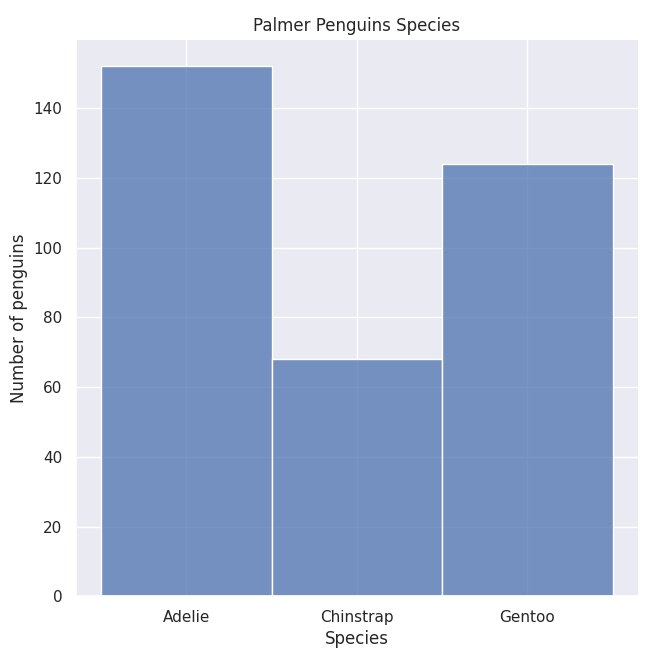
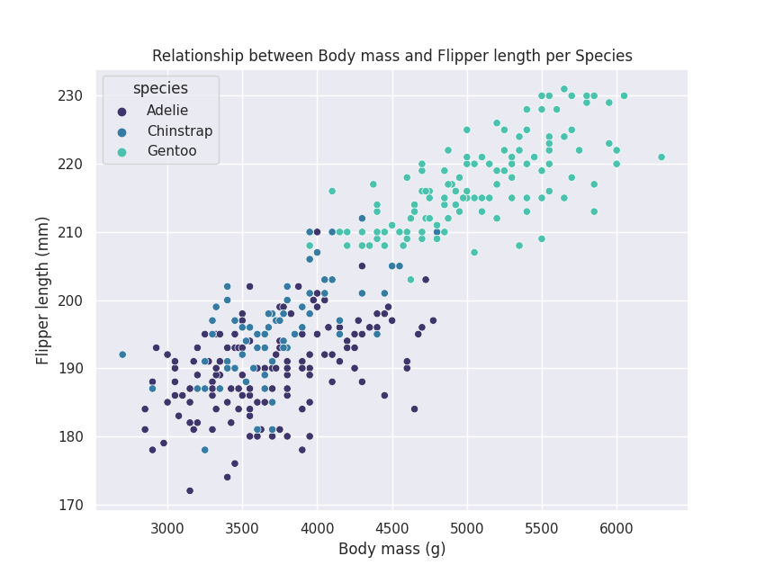
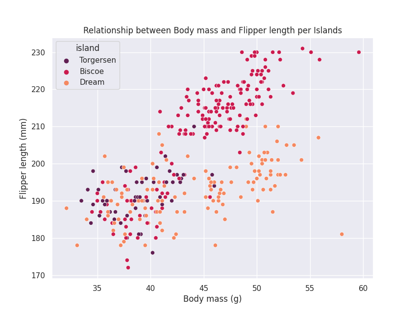
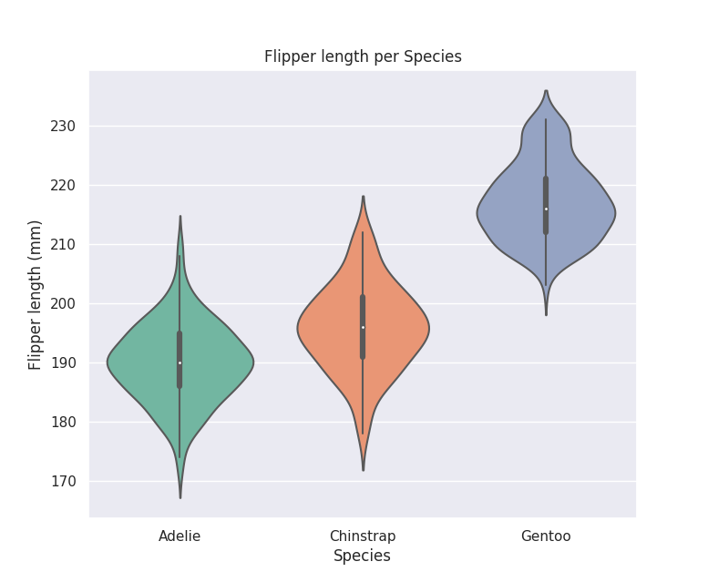
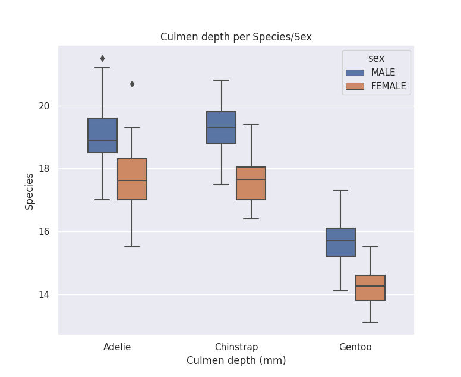

# Palmer_Penguins_Data
Simple Python script for analize and visualize Palmer Pinguins Dataset

## Program: **palmer_penguins**

## Dataset: Link to access [data](https://www.kaggle.com/code/parulpandey/penguin-dataset-the-new-iris/data).


## Description
This code use the Palmer Penguins dataset for analize and visualize some important characteristics of this dataset.

### Packages to use:
```
import pandas as pd
import seaborn as sns
import matplotlib.pyplot as plt
```
### Load the data
```
df = pd.read_csv("penguins_size.csv")
```
### Some functions to inspect the dataset
```
df.head() 
df.info() 
df.describe(include = "all") 
df.shape 
```
## Data Visualization
### Plot 1: 
* Number of penguins per Species
```
sns.set_theme(style = "darkgrid")
sns.displot(df, x = "species", binwidth = 3)
plt.ylabel("Number of penguins")
plt.xlabel("Species")
plt.title("Palmer Penguins Species")
plt.show()
```


### Plot 2:
* Relationship between body mass and the flipper length per species
```
sns.scatterplot(x = df["body_mass_g"], y = df["flipper_length_mm"], 
                hue = df["species"], palette = "mako")
plt.ylabel("Flipper length (mm)")
plt.xlabel("Body mass (g)")
plt.title("Relationship between Body mass and Flipper length per Species")
plt.show()
```


### Plot 3:
* Relationship between culmen length and flipper length per island
```
sns.scatterplot(x = df["culmen_length_mm"], y = df["flipper_length_mm"], 
                hue = df["island"], palette = "rocket")
plt.ylabel("Flipper length (mm)")
plt.xlabel("Body mass (g)")
plt.title("Relationship between Body mass and Flipper length per Islands")
plt.show()
```


### Plot 4:
* Relationship between flipper length and species
```
sns.violinplot(x = df["species"], y = df["flipper_length_mm"], palette = "Set2")
plt.ylabel("Flipper length (mm)")
plt.xlabel("Species")
plt.title("Flipper length per Species")
plt.show()
```


### Plot 5:
* Relationship between culmen depth and species/sex
```
ns.boxplot(x = df["species"], y = df["culmen_depth_mm"], width=0.5, fliersize = 5, hue = df["sex"])
plt.ylabel("Species")
plt.xlabel("Culmen depth (mm)")
plt.title("Culmen depth per Species/Sex")
plt.show()
```
